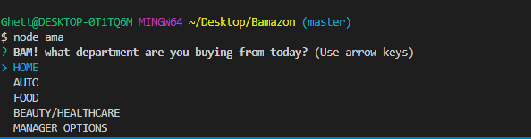
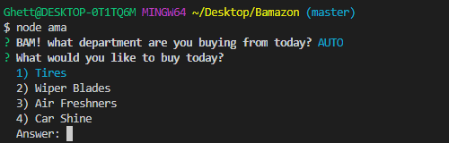
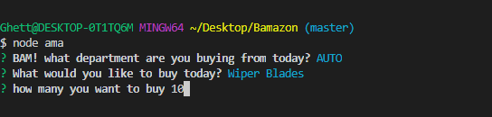
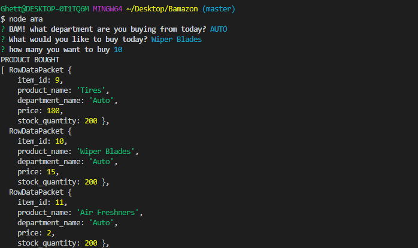

# Step one:
## Pick a department

# Step two:
## Pick an Item to buy from said department

# Step three:
## give a value

# Final step:
## Laugh at the fact that the stock doesn't change

# Do it all over again.